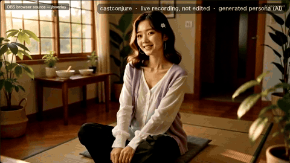
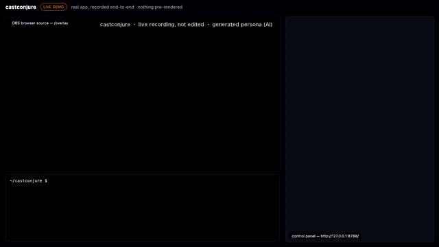

<p align="center">
  <a href="README.md">English</a> · <a href="README.ja.md">日本語</a> · <a href="README.ko.md">한국어</a>
</p>

<h1 align="center">castconjure</h1>

<p align="center"><b>自分だけのバーチャルアイドルを、生成する。口パクじゃなく。</b></p>
<p align="center">
  顔を 1 回生成すれば、ライブ配信のコメントで推しが踊る・食べる・喋る・場所を変える。<br>
  コメントの約 6 秒後に、ファンの言語で。
</p>

<p align="center">
  
</p>

<p align="center">
  <a href="LICENSE"></a>
  
  
  
  
</p>

---

**castconjure** は、生成したキャラクターをそのまま配信者にする OSS（MIT・BYOK）です。3D モデルもリギングもモーションキャプチャも口パクもありません。反応はすべて、その場で生成される 5 秒の映像で、声も本人のもの。口パクアバターは口が動くだけ。castconjure は動作・衣装・カメラ・場所ごと生成します。

自分の OC をすでに持っている作り手（まず日本語で作る人）と、英語・韓国語など海外の言語で見るファンのために作っています。推しは 1 体、チャットは世界中、使えるのは自分のオリジナルキャラだけ。フォトリアルでもアニメ調でも。[Conjure Board](https://purankuton2001.github.io/conjure-board/) では、推しごとに、反応のうち作り手の言語以外から来た割合が見えます。

castconjure は、同じ要件定義から 2 つのモデルが作った 2 つのアプリの片方です。もう 1 つは [AI OshiBloom](https://github.com/purankuton2001/ai-oshibloom)（スタジオ＋連続ライブ、GPT-6 製）。どちらももう片方のおまけではありません。比較は Board で。

## 体験

```
 0.0 秒   taro_k:  dance!!                                   （YouTube Live のチャット）
 0.2 秒   チャットを覗いて「え、なになに？ ちょっと待ってね」   ← 事前生成の「気づき」クリップ、即時
 4〜8 秒  立ち上がって踊る。字幕「taro_kさん！danceだね、やってみよ！」  ← いま生成、本人の声
 12 秒    待機ループに戻る
```

待ち時間の空白もネタバレもありません。返事は、それを演じる映像より先には出ません。`npm start` から 3 回目の反応までの実機録画：[docs/app-demo.mp4](docs/app-demo.mp4)

<p align="center"></p>

## 10 分で動かす

```bash
git clone https://github.com/purankuton2001/castconjure && cd castconjure
npm install && cp .env.example .env
npm start
```

Node 20 以上と **ffmpeg** が必要です（`brew install ffmpeg`）。`scripts/` の録画・計測ツールは Python 3 + Pillow と Google Chrome も使います。

**http://127.0.0.1:8787/** を開く。同梱の推し「白詰ゆい」が選ばれていて、最初は無料の mock で一周できます（mock では映像の代わりにテキストカードが出ます）。

1. **Persona → 顔ガチャ**：4 枚引いて 1 枚クリック、派生した参照（顔・全身・部屋）を確認して保存
2. **声ガチャ**（FAL_KEY が必要。候補の声は H3 が生成）：`npm run voice:gacha -- --n 2` → 気に入った番号を `npm run voice:gacha -- --adopt 1`
3. **待機プール**と**気づきクリップ**：`npm run idle -- --n 12`、`npm run ack -- --n 6`
4. OBS に **ブラウザソース**：`http://127.0.0.1:8787/overlay?audio=1`、1920 × 1080（声を OBS 側で扱うなら `?audio=1` を外す）
5. **▶ Start** → Test comment に「dance!!」。気づいて、踊る

本番はキーを `.env` に入れるだけ（外には出ません）：

```bash
BACKEND=fal            FAL_KEY=…              # fal.ai に直接課金、反応 1 本 約 $0.25
PLATFORM=youtube       YOUTUBE_API_KEY=…      # 自分の Google Cloud プロジェクト、OAuth 不要
REPLY_PROVIDER=gemini  GEMINI_API_KEY=…       # anthropic / openai も可。コメントの言語で返す
```

配信を始めて、動画 ID をパネルに貼って Start。

## 口パクアバターと何が違うか

| | Live2D／口パク | スタジオ製バーチャルアイドル | fal.live 型の無限配信 | **castconjure** |
|---|---|---|---|---|
| 動くもの | 口と首 | 全部（スタジオ込み） | 全部（固定の人格なし） | **全部。固定の推しがチャットで動く** |
| 作るには | 絵とリギングで数週間 | 数か月とチーム | — | **顔ガチャ→参照 3 枚→声→人格、約 10 分** |
| 一貫性 | モデルデータ | モデルデータ | なし | **固定 seed＋同じ説明文＋待機フレーム起点** |
| 声 | 別の TTS | 演者 | なし | **映像と一緒に生成。同じ seed で同じ声** |
| 費用 | GPU／サブスク | 予算 | 24 時間生成 | **待機は事前生成、反応 1 本 約 $0.25** |
| キーとデータ | 相手側 | 相手側 | 相手側 | **自分** |

seed による一貫性は fal バックエンドのもので、ローカル ComfyUI はまだ seed を渡しません。v0.1 で作れるのは女性の推しだけで、他のプリセットはロードマップにあります。

### 連続生成（H3 Max Director）を使わない理由

実測しました。`npm run probe:director` は本物の `minimax/h3-max/director` WebRTC セッションを待機フレームと seed から開き、30／60／90 秒でプロンプトを変えて音声付きで録画します。結果（2026 年 9 月、数値は [docs/DIRECTOR-PROBE.md](docs/DIRECTOR-PROBE.md)）：

| | H3 Max Director（連続） | castconjure（クリップ） |
|---|---|---|
| プロンプト変更 → 画面 | 3〜19 秒。8.5 秒チャンクのどこに落ちるかで変動 | 4〜8 秒。気づきクリップは 0.2 秒 |
| セッション | 120 秒で強制終了 | 無制限 |
| 2 分間の一貫性 | 顔と声は保つが、イヤリング・髪・偽チャット UI がにじむ | 毎回同じ待機フレームから開始 |
| 費用 | 分 $1.2（促販、定価 $4.8）、最低 60 秒 | 反応 1 本 約 $0.25、待機は無料 |

Director は「Turbo の image-to-video を前のフレームから繋ぐ」という同じ手法をサーバー側でやっているものです。セッション上限が外れた日に「ライブモード」バックエンドになります。土台はこの probe スクリプトです。

## 入っているもの

- **二層オーバーレイ**：待機ループの上に反応クリップをクロスフェード。OBS ブラウザソース 1 枚
- **気づきクリップ**：コメント 0.2 秒後に「気づいて一言」の事前生成クリップ 6 本からランダム再生
- **返事モード**：LLM（Gemini／Claude／OpenAI、自分のキー）がコメントの言語で一言。台詞と字幕になる
- **動作ディレクター**：「dance!!」を「立ち上がって全身で踊り、1 回転」に変換して映像に出す
- **推しはフォルダ**：`data/personas/<id>/` に参照・声・seed・待機・気づき。コピーして共有できる
- **自分の OC だけ**：実在アイドル・グループ・アニメ／ゲームのキャラ・「〇〇に似せて」「振付」は黙って除外。除外リスト（`data/ip-names.txt`、英・韓・日＋洋楽）は安全用のフィルタで、誰かを名指しするものではありません
- 承認モード、レート制限、視聴者ごとの冷却、セッション予算、コメント→クリップの JSONL ログ
- **バックエンド**：fal（既定は H3 Max Turbo の image-to-video、厳密モードは reference-to-video）、ローカル ComfyUI、mock
- **ツール**：`record:live`／`record:app`（headless の実機録画、レイテンシ計測、音声同期の数値検査）、`probe`、`probe:voice`、`probe:director`（H3 Max Director を 2 分回して録画・計測）

## 費用

fal で 2026 年 9 月に実測：

| 経路 | 反応 1 本（5 秒・480p） | コメント → 画面 |
|---|---|---|
| H3 Max Turbo image-to-video（既定） | **$0.25** | **4〜8 秒** |
| H3 Max reference-to-video（参照 3 枚＋参照音声） | $0.46 | 10〜13 秒 |

推しごとに 1 回：待機 12 本 ≈ $3、気づき 6 本 ≈ $1.5、参照 ≈ $0.15。30 秒に 1 回の反応で 60 分 ≈ $30。セッション上限は既定 $20。fal 側の月次上限も設定を。

## 安全設計

1. **自分のオリジナルキャラだけ**。顔はアプリ内生成のみで UI にアップロードはない（`persona:import` は自作の絵を入れる開発者向け経路）。顔生成のプロンプトには必ず「架空の成人、実在アイドル・既存キャラに似せない」が付く
2. **実在アイドル・既存 IP はどこでも除外**：コメント、返事、人格欄、顔ガチャ。「〇〇に似せて」「振付」も
3. **成人のみ。声は生成で、実在人物からの複製はしない**（クローン工程は声ガチャが生成した音声しか受け付けない）。**実在楽曲・振付は使わない**
4. **持ち主が主導**：ON/OFF・世界観・レート・承認・予算
5. **AI 明示**：表記は既定 ON。配信側でも合成コンテンツの開示を

castconjure は実在のアイドルを踊らせる道具でも、その代替でもありません。あなたの OC です。

## 貢献

Issue と PR を歓迎します。[CONTRIBUTING.md](CONTRIBUTING.md) を参照。最初の一歩に向くもの：Twitch アダプタ、新しい推しテンプレート、README の翻訳、あなたの言語の気づき台詞。

詳しい使い方（日本語）：[docs/GUIDE.md](docs/GUIDE.md)。アーキテクチャとロードマップは [英語 README](README.md#architecture) を参照。

## ライセンス

MIT。生成費用は利用者自身の fal アカウントに直接課金され、本プロジェクトは仲介しません。モデルは MiniMax H3（[fal](https://fal.ai) 経由）。
